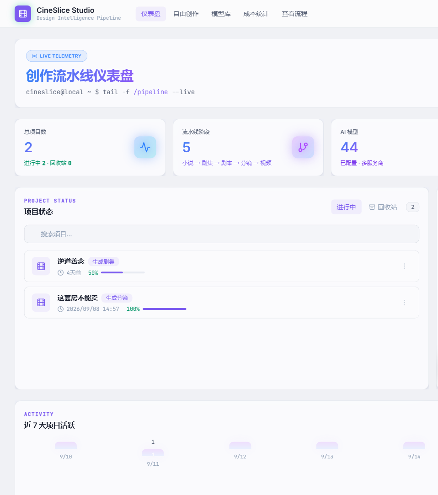
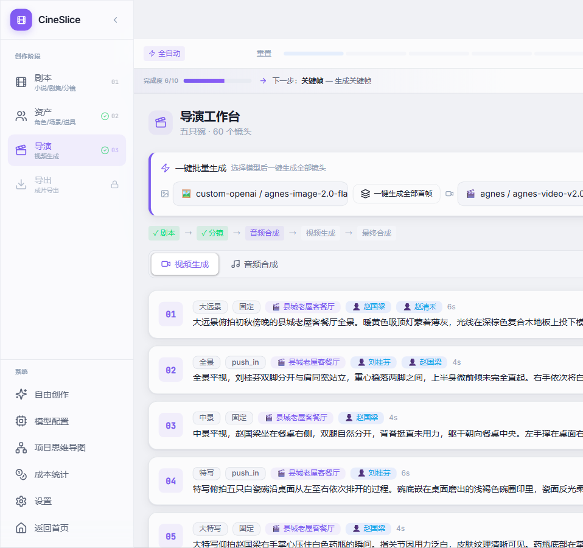
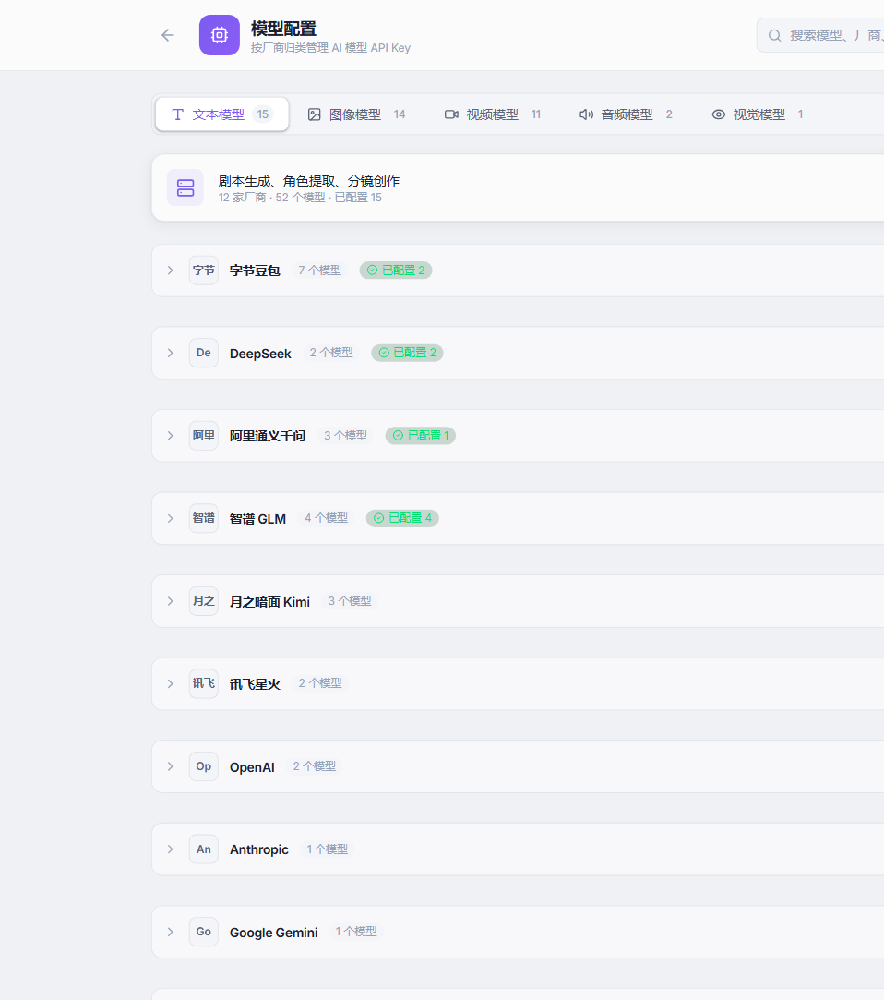
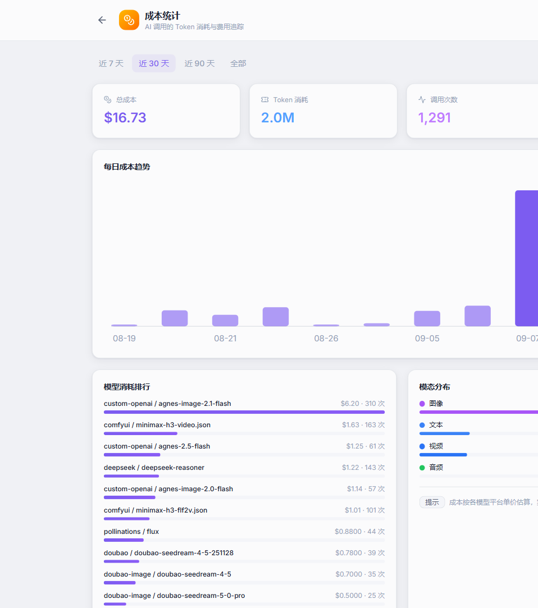
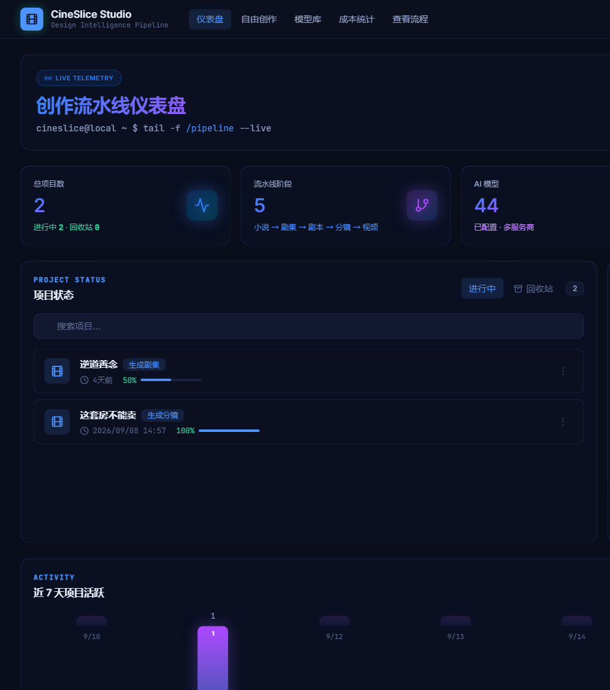
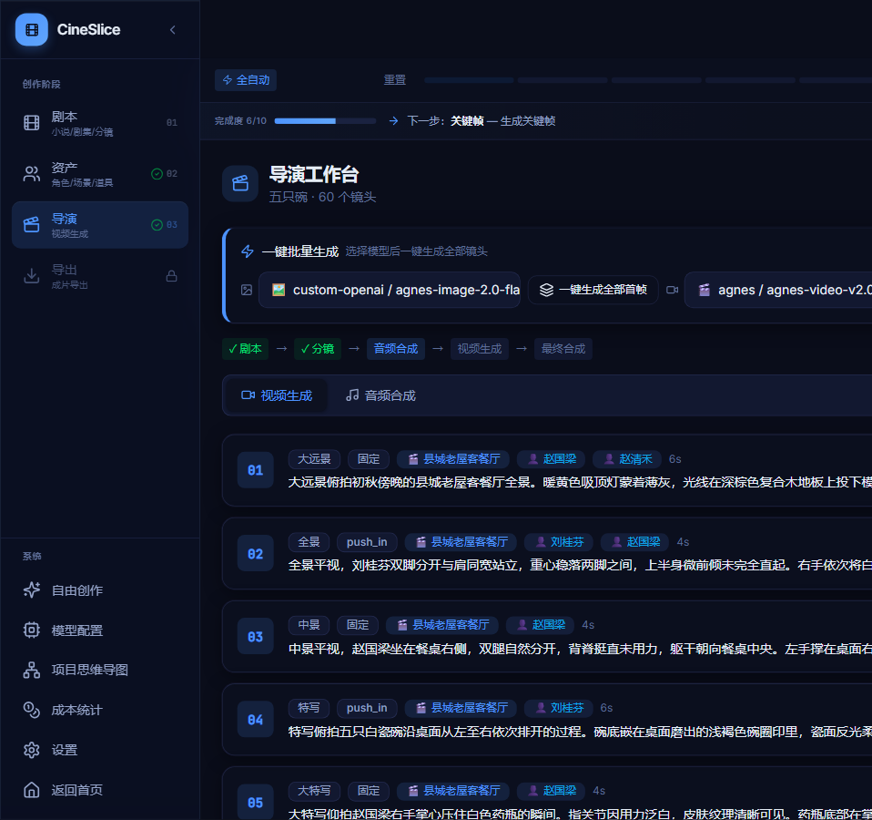
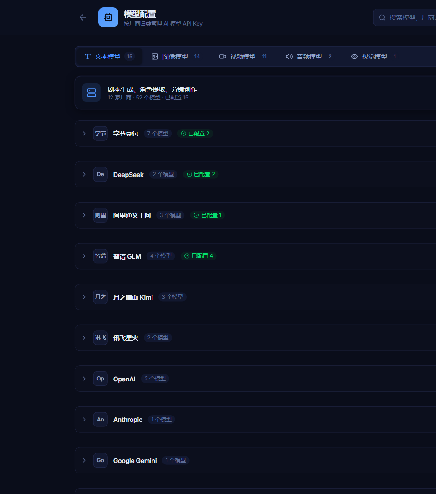
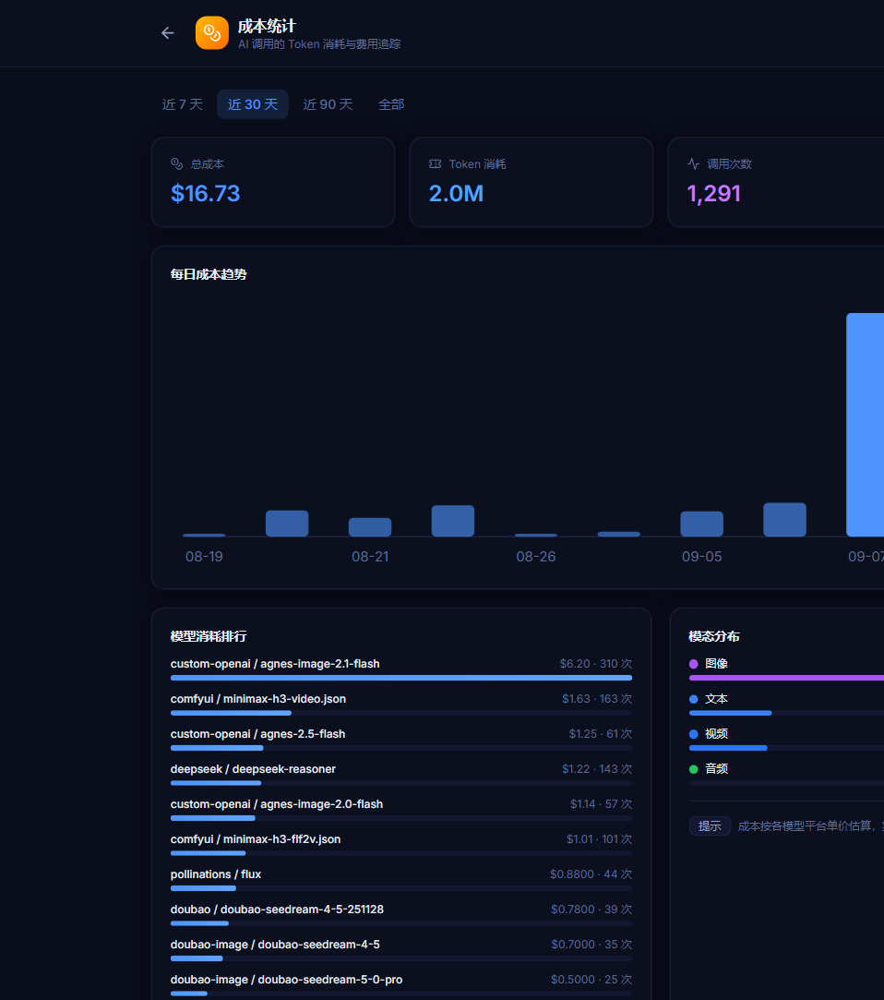

# CineSlice Studio（切片式影视锻造工厂）

> AI 驱动的全流程影视创作工具 —— 从一部小说到一支视频，只需 9 个阶段。
> **v1.2** —— 新增提示词 Skill 机制、短剧方法论注入（shuohao-skills 整合）、质量门后置校验、台词超时自动拆镜、本地 ComfyUI 视频接入、免费 Edge TTS 配音。

CineSlice Studio 是一款面向内容创作者的 AI 影视创作平台。它将"小说 → 剧集 → 剧本 → 角色 → 场景 → 分镜 → 关键帧 → 配音 → 视频"这一完整影视生产链路抽象为 **9 阶段流水线**，支持全自动与半自动两种模式，内置 30+ 主流 AI 模型适配，覆盖文本、图像、视频、音频四大模态。

---

## 📸 项目截图

### 亮色主题

<div align="center">
  
  
  
  
</div>

### 暗色主题

<div align="center">
  
  
  
  
</div>

---

## ✨ 核心功能

- **9 阶段全自动流水线**：小说上传 → 剧集拆分 → 剧本生成 → 角色设定 → 场景设定 → 分镜生成 → 关键帧 → 配音生成 → 视频生成，一键启动，断点可恢复。
- **双模式运行**：`auto`（全自动，AI 依次执行所有阶段）与 `semi-auto`（半自动，每阶段完成后等待人工确认再推进）。
- **30+ AI 模型适配**：
  - **文本**：豆包、DeepSeek、通义千问、智谱 GLM、Kimi、MiniMax、讯飞星火、GPT-4o、Claude、Gemini、硅基流动开源模型、Ollama 本地模型等 19 个。
  - **图像**：豆包 Seedream、通义万相、Wan 2.7、CogView、Stable Diffusion、DALL·E 3、Ideogram、Recraft、FLUX、硅基流动开源图像模型等 13 个。
  - **视频**：豆包 Seedance、可灵、即梦、海螺、MiniMax、HappyHorse、Runway、Pika 等 15 个。
  - **音频**：豆包 TTS、OpenAI TTS、ElevenLabs、Azure TTS、讯飞 TTS、通义 TTS、Edge TTS（免费）等 8 个。
- **自定义 OpenAI 兼容模型**：支持填入任意 OpenAI 兼容接口的 API Key 与 Endpoint，灵活接入私有部署或第三方网关。
- **小说智能解析**：上传 TXT 小说，自动识别章节标题并拆分，支持章节合并与拆分。
- **角色 / 场景 / 道具资产管理**：AI 自动提取剧本中的角色、场景、道具，生成概念图，支持多版本变体与共享资产库。
- **分镜与关键帧**：AI 自动生成分镜脚本（含景别、运镜、时长、对话），并为每个镜头生成首帧 / 尾帧 / 中间帧关键帧图像。
- **AI 配音与视频合成**：TTS 语音合成 + FFmpeg 视频拼接，输出完整成片。
- **风格预设**：内置多种影视风格预设（视觉风格、镜头语言、色彩 palette、节奏、视频参数），一键套用。
- **成本追踪**：自动记录每次 AI 调用的 Token 消耗与费用，便于成本管控。
- **提示词 Skill 机制**：每个视频模型配官方提示词 Skill（MiniMax H3 / 可灵 / Seedance / 通用），AI 分析剧情前自动注入适配规范，转换后保证语句通顺、剧情连贯、资产一致。
- **短剧方法论注入（shuohao-skills 整合）**：内置开源 AI 短剧制作技能集（novel-outline / novel-characters / novel-art / novel-script / novel-storyboard，Apache-2.0），将其质量门方法论注入 5 个流水线节点：剧集（角色分档/爽点节奏/钩子悬念）、角色（出图提示词禁人名/区分度）、场景（一致性锚点/光照变体）、分镜（切镜节奏/参考图纪律）、关键帧（风格统一）。
- **质量门后置校验**：分镜 / 角色 / 场景生成后自动运行确定性检查——台词装得下镜头（4.5 字/秒折算）、同框 ≤3 人、镜头序号连续、角色/场景重名、资产描述完整性等，结果写入任务进度。
- **台词超时自动拆镜**：台词折算超过 5 秒镜头容量的镜头，自动拆成多个连续短镜（每镜 5 秒、台词 ≤20 字，最多两轮，防烧额度），"话说不完"的镜头不再流入视频生成。
- **本地 ComfyUI 视频生成**：支持接入本地 ComfyUI（首尾帧 / 图生视频工作流），首帧、尾帧由图像模型分别生成后交给视频模型续写，人物一致性显著提升。
- **免费 Edge TTS 配音**：开源免费语音合成，台词逐句对齐镜头，音色可配。
- **本地优先**：默认本地模式（SQLite + 单用户），零配置启动；同时预留服务端多用户模式。

### v1.2 新增

- **提示词 Skill 机制（每个视频模型一个官方 Skill）**：内置 MiniMax H3、可灵、Seedance 2.0/2.5、通用视频模型的官方提示词规范，换模型后自动注入适配提示词；模型配置页展示模型徽标。
- **shuohao-skills 方法论注入**：5 个开源 AI 短剧技能（Apache-2.0，1170 项确定性断言全过）完整落地 `stageSkills/vendor`，方法论规则注入 episodes / characters / scenes / shots / keyframes 五节点（幂等去重）。
- **质量门检查器（gates.ts）**：分镜 / 角色 / 场景三阶段生成后自动后置校验：台词容量（4.5 字/秒 × 镜头秒数）、同框上限 3 人、镜头序号连续、资产描述完整性、重名检测、概念图提示词禁其他角色名；只读不阻断，结果记入任务进度。
- **台词超时自动拆镜**：检测到台词折算超时的镜头，自动调用文本模型拆成 2-3 个连续短镜（每镜 5 秒、台词 ≤20 字、景别/机位变化），事务内替换并重排镜号，复检最多两轮，防止死循环烧额度。
- **本地 ComfyUI 视频生成链路**：视频生成支持本地 ComfyUI 适配器（首尾帧工作流），首帧 / 尾帧由图像模型生成，视频模型据此续写；模型选择界面标注"支持首尾帧"。
- **免费配音（Edge TTS）**：开源 Edge TTS 适配器替代付费 TTS，台词逐句对齐分镜，支持音色与语速配置。
- **半自动流程引导**：每阶段完成后提示下一步操作；一键生成全自动运行，只提醒预估时间。

### v1.1 新增

- **项目回收站**：删除项目先进入回收站，可一键恢复；也可二次确认后彻底删除（级联清理剧本/角色/分镜/视频等 13 张子表与磁盘文件）。
- **全局命令面板（Ctrl+K）**：搜索项目、跳转制作阶段、执行常用操作（新建/模型配置/主题切换等），按 `?` 查看快捷键帮助。
- **任务中心**：顶栏铃铛实时展示进行中的 AI 生成任务进度与角标计数，支持取消任务。
- **成本统计页（/costs）**：总成本 / Token / 调用次数 / 日均成本总览，每日趋势 SVG 图表、模型消耗排行、模态分布与最近调用明细，支持 7/30/90 天与全部时间范围。
- **服务端加固**：安全响应头（nosniff / SAMEORIGIN / Referrer-Policy / Permissions-Policy）、登录注册接口限流（15 分钟 20 次）、API 未知路径返回 JSON 404、慢请求（≥1s）日志、生产响应 gzip/brotli 压缩。
- **安全修复**：封锁 `/data` 静态托管对 SQLite 数据库文件的下载。

---

## 🛠 技术栈

| 层级 | 技术 |
|------|------|
| **前端框架** | React 19 + TypeScript 5.6 |
| **构建工具** | Vite 6（含 gzip / brotli 压缩、自动端口检测） |
| **样式方案** | TailwindCSS 4 + Radix UI 原语 |
| **状态管理** | Zustand 5 |
| **路由** | React Router 6 |
| **动画 / 图标** | Framer Motion + Lucide React |
| **表单校验** | Zod |
| **HTTP 客户端** | Axios |
| **后端框架** | Express 4 + TypeScript |
| **数据库** | SQLite（better-sqlite3），迁移脚本 25 个 |
| **认证** | JWT + bcryptjs（本地模式免登录） |
| **AI 接入** | OpenAI SDK + Axios 自定义适配器（适配器模式，30+ 模型） |
| **视频处理** | ffmpeg-static + Python 辅助脚本 |
| **文件上传** | Multer |
| **测试** | Vitest |
| **代码规范** | ESLint 9 + TypeScript ESLint |

---

## 🚀 快速开始

### 环境要求

- **Node.js** >= 20.0.0
- **npm** >= 10
- （可选）**Python 3** —— 部分视频合成辅助脚本使用
- （可选）**FFmpeg** —— 项目已内置 `ffmpeg-static`，通常无需单独安装

### 安装与启动

```bash
# 1. 克隆项目
git clone <repository-url>
cd CineSlice-Studio

# 2. 安装依赖
npm install

# 3. 复制环境变量配置（首次运行）
cp .env.example .env
# Windows: copy .env.example .env

# 4. 启动开发环境（前端 + 后端同时启动）
npm run dev
```

启动后：
- 前端开发服务器：`http://localhost:5173`（端口被占用时自动递增）
- 后端 API 服务：`http://localhost:3000`（端口被占用时自动递增）
- 健康检查：`http://localhost:3000/api/health`

> 本地模式（`RUN_MODE=local`）下无需注册登录，系统自动创建 `local_user` 默认用户。

### 生产构建

```bash
# 构建前端 + 后端
npm run build

# 启动生产服务（后端同时托管前端静态文件）
npm start
```

### 常用脚本

| 命令 | 说明 |
|------|------|
| `npm run dev` | 同时启动前端（Vite）和后端（tsx watch）开发服务 |
| `npm run dev:client` | 仅启动前端开发服务 |
| `npm run dev:server` | 仅启动后端开发服务 |
| `npm run build` | 构建前端（`dist/`）和后端（`server/dist/`） |
| `npm start` | 启动生产服务（`node server/dist/index.js`） |
| `npm run lint` | ESLint 检查 `src/` 和 `server/src/` |
| `npm run typecheck` | 前后端 TypeScript 类型检查 |
| `npm test` | 运行 Vitest 单元测试 |
| `npm run migrate` | 手动执行数据库迁移 |
| `npm run seed` | 执行种子数据（内置风格预设） |

---

## 📁 目录结构

```
CineSlice-Studio/
├── src/                          # 前端源码
│   ├── components/               # React 组件
│   │   ├── LandingPage/          # 落地页
│   │   ├── Onboarding/           # 新手引导
│   │   ├── ModelConfig/          # 模型配置页
│   │   ├── Pipeline/             # 流水线进度组件
│   │   ├── StageScript/          # 阶段1：剧本（小说上传/剧集/剧本/分镜）
│   │   ├── StageAssets/          # 阶段2：资产（角色/场景/道具）
│   │   ├── StageDirector/        # 阶段3：导演（关键帧/配音）
│   │   ├── StageExport/          # 阶段4：导出（视频合成/下载）
│   │   ├── MindMap/              # 思维导图
│   │   ├── StylePreset/          # 风格预设选择器
│   │   ├── ui/                   # 通用 UI 组件（Button/Card/Modal/Toast...）
│   │   ├── Dashboard.tsx         # 项目列表仪表盘
│   │   ├── Login.tsx             # 登录页
│   │   ├── SettingsPage.tsx      # 设置页
│   │   ├── Sidebar.tsx           # 侧边栏
│   │   ├── Topbar.tsx            # 顶栏
│   │   └── ProjectLayout.tsx     # 项目工作台布局
│   ├── services/                 # 前端服务层（API 调用封装）
│   │   ├── apiClient.ts          # Axios 实例与拦截器
│   │   ├── authService.ts        # 认证
│   │   ├── projectService.ts     # 项目 CRUD
│   │   ├── pipelineService.ts    # 流水线
│   │   ├── modelConfigService.ts # 模型配置
│   │   ├── assetService.ts       # 角色/场景/道具
│   │   ├── shotService.ts        # 分镜/关键帧
│   │   ├── audioService.ts       # 配音
│   │   ├── videoService.ts       # 视频生成
│   │   ├── videoComposeService.ts# 视频合成
│   │   ├── exportService.ts      # 项目导出
│   │   ├── stylePresetService.ts # 风格预设
│   │   ├── preferenceService.ts  # 用户偏好
│   │   ├── taskService.ts        # 异步任务
│   │   ├── novelParser.ts        # 小说解析
│   │   └── ai/                   # AI 提示词常量
│   ├── stores/                   # Zustand 状态管理
│   │   ├── useAuthStore.ts
│   │   ├── useProjectStore.ts
│   │   ├── useModelStore.ts
│   │   ├── useTaskStore.ts
│   │   └── useUIStore.ts
│   ├── contexts/                 # React Context
│   │   ├── AuthContext.tsx
│   │   └── ThemeContext.tsx
│   ├── hooks/                    # 自定义 Hooks
│   ├── config/                   # 配置（视频模型配置等）
│   ├── types/                    # 前端类型定义
│   ├── utils/                    # 工具函数
│   ├── styles/                   # 全局样式
│   ├── App.tsx                   # 根组件（路由定义）
│   └── main.tsx                  # 入口
├── server/                       # 后端源码
│   └── src/
│       ├── index.ts              # 后端入口（Express 应用初始化）
│       ├── config/               # 配置
│       │   ├── env.ts            # 环境变量加载与校验
│       │   ├── database.ts       # 数据库初始化（自动迁移）
│       │   └── sqliteDatabase.ts # SQLite 连接封装
│       ├── middleware/           # 中间件
│       │   ├── auth.ts           # JWT 认证
│       │   ├── errorHandler.ts   # 全局错误处理
│       │   ├── upload.ts         # Multer 文件上传
│       │   └── validate.ts       # Zod 请求校验
│       ├── models/               # 数据访问层（DAO）
│       │   ├── index.ts          # DAO 统一导出
│       │   ├── user.ts           # 用户
│       │   ├── project.ts        # 项目
│       │   ├── novelChapter.ts   # 小说章节
│       │   ├── novelEpisode.ts   # 剧集
│       │   ├── scriptCharacter.ts# 角色
│       │   ├── scriptScene.ts    # 场景
│       │   ├── scriptProp.ts     # 道具
│       │   ├── shot.ts           # 镜头
│       │   ├── shotKeyframe.ts   # 关键帧
│       │   ├── shotVideoInterval.ts # 视频片段
│       │   ├── generationTask.ts # 异步生成任务
│       │   ├── modelRegistry.ts  # 模型配置注册表
│       │   ├── stylePreset.ts    # 风格预设
│       │   ├── costRecord.ts     # 成本记录
│       │   ├── aiCache.ts        # AI 缓存
│       │   └── ...               # 其他 DAO
│       ├── routes/               # 路由层
│       │   ├── auth.ts           # 认证
│       │   ├── projects.ts       # 项目 + 小说上传 + 剧集生成
│       │   ├── episodes.ts       # 剧集详情 + 剧本 + 分镜 + 关键帧
│       │   ├── assets.ts         # 角色/场景/道具资产
│       │   ├── models.ts         # 模型配置（30+ 内置模型元数据）
│       │   ├── pipeline.ts       # 流水线状态管理
│       │   ├── ai.ts             # AI 生成代理
│       │   ├── tasks.ts          # 异步任务
│       │   ├── audio.ts          # 配音 TTS
│       │   ├── videoCompose.ts   # 视频合成
│       │   ├── stylePresets.ts   # 风格预设
│       │   ├── visualStyles.ts   # 视觉风格
│       │   ├── preferences.ts    # 用户偏好
│       │   ├── dataTransfer.ts   # 项目导入/导出
│       │   └── projectPatch.ts   # 项目批量补丁
│       ├── services/             # 业务服务层
│       │   ├── aiProxy.ts        # AI 调用统一代理（文本/图像/视频/音频）
│       │   ├── pipelineService.ts # 流水线状态机
│       │   ├── autoPipelineService.ts # 全自动流水线调度
│       │   ├── scriptAnalysisService.ts # 剧本分析（角色/场景提取）
│       │   ├── directorPromptService.ts # 导演提示词服务
│       │   ├── promptOptimizationService.ts # 提示词优化
│       │   ├── aiPromptOptimizerService.ts # AI 提示词优化器
│       │   ├── audioComposer.ts  # 音频合成
│       │   ├── videoComposer.ts  # 视频合成（FFmpeg）
│       │   ├── novelParser.ts    # 小说解析
│       │   ├── stageSkills/      # 短剧技能集整合（shuohao-skills）
│       │   │   ├── index.ts        # 技能注册表 + applyStageRules（幂等注入）
│       │   │   ├── gates.ts        # 质量门检查器（分镜/角色/场景）
│       │   │   └── vendor/         # novel-outline/characters/art/script/storyboard 全量技能
│       │   ├── promptSkills/       # 视频模型官方提示词 Skill（H3/可灵/Seedance/通用）
│       │   ├── costTracker.ts    # 成本追踪
│       │   ├── exportService.ts  # 项目导出
│       │   ├── importService.ts  # 项目导入
│       │   ├── projectStorage.ts # 项目文件存储
│       │   ├── modelUtils.ts     # 模型工具函数
│       │   ├── adapters/         # AI 模型适配器（适配器模式）
│       │   │   ├── base.ts       # 适配器基类与接口
│       │   │   ├── registry.ts   # 适配器注册中心
│       │   │   ├── text/         # 文本模型适配器（13 个 provider）
│       │   │   ├── image/        # 图像模型适配器（12 个 provider）
│       │   │   ├── video/        # 视频模型适配器（含本地 ComfyUI）
│       │   │   │   ├── comfyui.ts  # 本地 ComfyUI（首尾帧工作流）
│       │   │   │   └── ...         # 豆包/可灵/即梦/海螺/MiniMax 等
│       │   │   └── audio/        # 音频模型适配器（含免费 Edge TTS）
│       │   │       └── edge-tts.ts # 开源免费语音合成
│       │   └── prompts/          # AI 提示词模板
│       │       ├── novelToScript.ts      # 小说转剧本
│       │       ├── characterExtract.ts    # 角色提取
│       │       ├── sceneExtract.ts        # 场景提取
│       │       ├── shotGeneration.ts      # 分镜生成
│       │       ├── keyframePrompt.ts      # 关键帧
│       │       ├── videoQuality.ts        # 视频质量
│       │       └── promptRecommendations.ts # 提示词推荐
│       ├── migrations/           # 数据库迁移脚本（001 ~ 012）
│       ├── seed/                 # 种子数据
│       │   └── seedStylePresets.ts # 内置风格预设
│       ├── scripts/              # 运维脚本
│       │   ├── migrate.ts        # 迁移执行
│       │   └── seed.ts           # 种子执行
│       ├── types/                # 后端共享类型
│       │   └── index.ts
│       └── utils/                # 工具函数
│           ├── aiJsonParser.ts   # AI 返回 JSON 解析（容错）
│           ├── aiErrorHandler.ts # AI 错误处理
│           ├── filename.ts       # 文件名编码处理
│           └── portManager.ts    # 端口管理
├── scripts/                      # 辅助脚本（Python / Node）
│   ├── compose_video.py          # 视频合成
│   ├── edge_tts_server.py        # Edge TTS 服务
│   ├── generate_narration.py     # 旁白生成
│   ├── configure_api_keys.js     # API Key 配置工具
│   └── ...
├── data/                         # 运行时数据（SQLite 数据库、生成文件）
├── uploads/                      # 用户上传文件
├── outputs/                      # 视频输出目录
├── docs/                         # 项目文档
├── .env.example                  # 环境变量示例
├── .env                          # 环境变量（本地）
├── package.json
├── tsconfig.json                 # 前端 TS 配置
├── tsconfig.server.json          # 后端 TS 配置
├── vite.config.ts                # Vite 配置（含端口自动检测、代理、压缩）
├── vitest.config.mjs             # 测试配置
└── eslint.config.js              # ESLint 配置
```

---

## 📖 文档索引

| 文档 | 说明 |
|------|------|
| [用户使用指南](docs/用户使用指南.md) | 从注册到生成视频的完整小白操作指南 |
| [开发文档](docs/开发文档.md) | 前端/后端架构、核心模块说明、开发规范 |
| [API 文档](docs/API文档.md) | 后端 API 接口列表、请求/响应格式 |
| [数据库设计](docs/数据库设计.md) | 表结构、字段说明、关系图 |
| [部署文档](docs/部署文档.md) | 环境要求、安装步骤、配置说明、常见问题 |

---

## 📄 License

Apache-2.0（公开仓库）。内置第三方技能集 shuohao-skills 遵循 Apache-2.0；内置视频模型提示词规范归各厂商所有，仅作接入适配。
